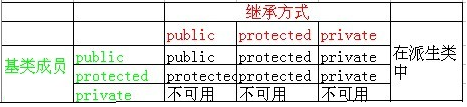

# C++基础知识

局部变量可以和全局变量的名称相同，但是在函数内，局部变量的值会覆盖全局变量的值。

全局变量、静态局部变量保存在全局数据区，初始化的和未初始化的分别保存在一起，普通局部变量保存在堆栈中，

## 关键字

### static

1. 在函数体内部定义变量，该变量从程序开始到结束只会分配一次内存，当再次进入该函数的时候，其值不变，仍为上次退出时的值
2. 模块内的static定义的变量和函数不能被外部引用，唯一的办法是通过一个间接变量或者函数来引用才行。
3. **类中定义的static变量属于整个类，即类成员变量，与对象无关,只会在运行的时候创建一次。**
4. 类中定义的static函数属于整个类，及类成员函数，与对象无关，所以不能在静态函数里面使用this指针，这个是对象独有的。

* 因为类的静态成员函数属于整个类，而非类的对象，所以静态成员函数没有this指针，静态成员函数只能引用静态成员变量。
* 模块内的static定义的变量和函数不能被外部引用，唯一的办法是通过一个间接变量或者函数来引用才行。
* 如果对于变量和函数添加static修饰，就会对其他源文件隐藏，在其他的.cpp文件无法调用函数。利用这一特性可以在不同的文件中定义同名函数和同名变量，而不用担心命名冲突。
* 不能将静态成员函数定义成虚函数。
* 静态成员和函数不计入``sizeof``中.

### 为什么要用静态变量？

1. static修饰类的成员变量，是为了将当前变量限制为类的变量，而不是类实例的变量，该变量可用来在类的外面进行初始化，而不受类构造函数的影响。比如可以用于表示一个类被创建了多少次。
2. **隐藏：**static修饰普通变量时，是为了避免不同的文件中同名，将这个同名变量限制在当前CPP文件中使用。定义了static变量时，在这个文件中都可以使用。
3. **保持变量内容的持久：**存储在静态数据区的变量会在程序刚开始运行的时候就完成初始化，也是唯一一次初始化，如果作为static局部变量在函数内定义，它的生存期为整个源程序，但是其作用域仍与自动变量相同，只能在定义该变量的函数内使用该变量。退出该函数后， 尽管该变量还继续存在，但不能使用它。

### ``const``

* ``const``定义的普通变量只能初始化时进行赋值，之后不可以再更改其值；

* ``const``修饰指针

  ```C++
  const int* p = &a;//不可以修改*p， 可以修改p, a
  int const *p = &a;//不可以修改*p， 可以修改p, a
  int* const p = &a;//不可以修改p， 可以修改*p, a
  ```

* 在函数形参声明中，使用``const``，可以防止传进来的参数被修改；

* 在类中使用``const``定义的函数，在函数内部不能修改成员变量的值，但是可以修改传进来的形参值。

### extern

**extern：**当使用多个文件且只在其中一个文件中定义变量时，可以使用extern关键字在任何地方声明变量。

### 类的继承



### 友元函数

类的友元函数是定义在类外部，但有权访问类的所有私有（private）成员和保护（protected）成员。**尽管友元函数的原型有在类的定义中出现过，但是友元函数并不是成员函数。**

### 数组地址

```C++
int a[] = { 1,2,3,4,5 };
cout << "a[0]: " << &a[0] << endl;//0x7fffffffe030
cout << "a[4]: " << a[4] << endl;//5
cout << "(&a[0] + 1): " << &a[0] + 1 << endl;//0x7fffffffe034
cout << "(a + 1): " << a + 1 << endl;//0x7fffffffe034
cout << "&a + 1: " << &a + 1 << endl;//0x7fffffffe044
```

&a + 1认为a是一个对象，对于一个对象的指针加一，地址会加上一个对象的地址大小，例如如果p为``int``型的指针，p + 1的地址为p的地址加上4。a与&a虽然地址一样，但是概念不一样，a表示数组的首地址，而&a表示的是整个对象的首地址。

### 浅拷贝与深拷贝

浅拷贝是两个对象共享一块内存，缺点是当析构一个对象的时候，另一个对象也不存在了，如果再使用它就会发生错误 。深拷贝就是完完全全的复制出一个对象，两者在内存上无任何关系。

写时复制，当需要对于共享的内存写入的时候才会复制。

### 不能重载的5个运算符

```
.(成员访问运算符)
->(成员指针运算符)
::(作用域解析运算符)
？(条件运算符)
sizeof
```


#### 优先队列(priority_queue)

priority_queue与queue的区别在于前者可以自定义其中数据的优先级，让优先级高的排在前面，优先出队。

定义：`` priority_queue<Type, Container, Functional>``

Type为数据类型，``Container``为数据容器，常用``vector``或``deque``，不能使用``list``，``Functional``为比较函数，``greater<int>``表示升序，``less<int>``表示降序，也可以自己写一个比较函数作为输入

```C++
#include<iostream>
#include<queue>
#include<cstdlib>
using namespace std;
struct Node{
	int x,y;
	Node(int a=0, int b=0):
		x(a), y(b) {}
};
 
struct cmp{
	bool operator()(Node a, Node b){
		if(a.x == b.x)	return a.y>b.y;
		return a.x>b.x;
	}
};

bool mycmp(Node a, Node b){
    if(a.x == b.x)	return a.y>b.y;
    return a.x>b.x;
}
 
int main(){
	priority_queue<Node, vector<Node>, cmp> p;
	priority_queue<Node, vector<Node>, decltype(&cmp) > myq(cmp);
	for(int i=0; i<10; ++i)
		p.push(Node(rand(), rand()));
		
	while(!p.empty()){
		cout<<p.top().x<<' '<<p.top().y<<endl;
		p.pop();
	}
	return 0;
}
```

#### decltype关键字

decltype的意义：

有时我们希望从表达式的类型推断出要定义的变量类型，但是不想用该表达式的值初始化变量（初始化可以用`auto`）。为了满足这一需求，C++11新标准引入了`decltype`类型说明符，它的作用是选择并返回操作数的数据类型，在此过程中，编译器分析表达式并得到它的类型，却不实际计算表达式的值。

```C++
int a;
decltype(a) b;//b为int型
```

#### auto关键字

C++11中对关键字auto进行了重新定义，可以让编译器根据初始值类型自动推断变量的类型。

使用auto需要注意的地方：

1. 使用auto关键字的变量必须有初始值。

2. 使用auto关键字声明变量的类型，不能自动推导出顶层的CV-qualifiers和引用类型，除非显示声明。

   ```C++
   int &r = 10;
   auto a = r;//a为int型，但不是引用
   auto &b = r;//b为int型的引用
   ```

3. 使用auto关键字进行类型推导时，编译器会自动忽略顶层const，除非显示声明。

4. 对于数组类型，auto关键字会推导为指针类型，除非被声明为引用。

   ```C++
   int a[100];
   auto b = a;//b为int*型
   ```

### 函数指针

就象某一数据变量的内存地址可以存储在相应的指针变量中一样，函数的首地址也以存储在某个函数指针变量里的。这样，我就可以通过这个函数指针变量来调用所指向的函数了。

```C++
void myFun(int x);// declarate a function
void (*FunP)(int);//declarate a function pointer variable FunP
FunP = &myFun;//definition

myFun(10);//直接调用myFun
(*FunP)(10);//通过函数指针变量来调用myFun函数
```

1）其实，MyFun的函数名与FunP函数指针都是一样的，即都是函数指针。MyFun函数名是一个函数指针常量，而FunP是一个函数数指针变量，这是它们的关系。
2）但函数名调用如果都得如(*MyFun)(10)这样，那书写与读起来都是不方便和不习惯的。所以C语言的设计者们才会设计成又可允许MyFun(10)这种形式地调用（这样方便多了并与数学中的函数形式一样，不是吗？）。
3）为统一起见，FunP函数指针变量也可以FunP(10)的形式来调用。
4）赋值时，即可FunP = &MyFun形式，也可FunP = MyFun。

**只在数值上，``myFun, &myFun, *myFun``相等，均为函数首地址，``FunP,*FunP``相等，也均为函数首地址。**

既然函数指针变量是一个变量，当然也可以作为某个函数的参数来使用的。所以，你还应知道函数指针是如何作为某个函数的参数来传递使用的。结合decltype用于声明

```C++
void myFun(int x);
void callMyFun( decltypr(myFun) fp, int x){
	fp(x);//即把x做参数输入调用myFun；
}
```

### 二分查找

```C+
int binarySearch(vector<int> nums, int target) {
    int left = 0; 
    int right = nums.size() - 1; // 注意

    while(left <= right) { // 注意
        int mid = (right + left) / 2;
        if(nums[mid] == target)
            return mid; 
        else if (nums[mid] < target)
            left = mid + 1; // 注意
        else if (nums[mid] > target)
            right = mid - 1; // 注意
        }
    return -1;
}
```

寻找左侧边界的二分搜索

```C++
int searchL(vector<int>& nums, int target){
        if(nums.empty()) return -1;
        int l = 0, r = nums.size();
        int mid;
        while(l < r)//如果r = size, 则为l < r, 如果r = size-1, 条件为l <= r 
        {
            mid = (l + r)/2;
            if(nums[mid] == target) r = mid;
            else if(nums[mid] > target) r = mid;
            else if(nums[mid] < target) l = mid +1;
        }
        if( l == nums.size() ) return -1;
        return nums[l] == target ? l: -1;
    }
```

寻找右侧边界的二分搜索

```
int searchR(vector<int>& nums, int target){
        if(nums.empty()) return -1;
        int l = 0, r = nums.size();
        int mid;
        while(l < r){
            mid = (l + r)/2;
            if(nums[mid] == target) l = mid+1;
            else if(nums[mid] > target) r = mid;
            else if(nums[mid] < target) l = mid +1;
        }
        if( r == 0 ) return -1;
        return nums[r-1] == target ? r-1 : -1;
    }
```

### 贪心算法

所谓贪心算法是指，在对问题求解时，总是**做出在当前看来是最好的选择**。也就是说，不从整体最优上加以考虑，它所做出的仅仅是在某种意义上的**局部最优解**。贪心算法没有固定的算法框架，算法设计的关键是贪心策略的选择。必须注意的是，贪心算法不是对所有问题都能得到整体最优解，选择的贪心策略必须具备无后效性（即某个状态以后的过程不会影响以前的状态，只与当前状态有关。）

**基本思路：**

- 建立数学模型来描述问题
- 把求解的问题分成若干个子问题
- 对每个子问题求解，得到子问题的局部最优解
- 把子问题的解局部最优解合成原来问题的一个解


### 仿函数（factor）

functor（仿函数）, 或者称之为function object(函数对象)， 是STL的四大组件之一。

什么是仿函数：一个函数对象是封装在类中， 从而看起来更像是一个对象。 这个类只有一个成员函数， 即重载了（） (括号)的运算符。 它没有任何数据。 该类被模板化了， 从而可以应付多种数据类型。

对于需要输入函数作为参数输入的时候，且该函数内又有参数需要输入，这时候函数模板遇到瓶颈，使用仿函数可以大量简化代码。

```C++
template<int val>
void addVal(int i){
    cout << val +i << endl;
}
int main(){
    vector<int> vec = {2,3,4,5};
    int x = 2;
    for_each(vec.begin(), vec.end(), addVal<x>);
    //无法通过编译，因为模板变量必须要是constant
}
```

使用仿函数

```C++
class AddValue{
    int val;
    public:
    AddValue(int j) : val(j) {}
    void operator() (int i){//functor
        cout << i+ val << endl;
    }
};
int main(){
    vector<int> vec = {2,3,4,5};
    int x = 2;
    for_each(vec.begin(), vec.end(), addValue(x));
}
```

事实上， 我们并不需要要自己去写仿函数。 C++ 的STL中有内置的functor供我们使用。例如less, greater, greater_equal, less_equal等等

 但是对于C++11而言， 还有更好的解决办法， 那就是使用**lambda function**, 这样， 我们就不需要额外的编写函数needCopy了：

```C++
int main(){
    vector<int> vec = {2,3,4,5};
    int x = 2;
    sort(vec.begin(), vec.end(), 
             [](int a, int b){return a>b;});
}
```

对于需要一个function type作为参数输入的类，通过functor实现，例如

```C++
bool lsb_less(int x,int y){
    return (x%10) < (y%10);
}
int main(){
    set<int,lsb_less> myset = {3,1,25,7,12};
    //无法通过编译，因为set 需要的是一个function type 作为其第二个参数， 而非一个函数（lsb_less）。
}
```

```C++
template <typename T> class lsb_less{
    public:
    bool operator() (T x,T y){
        return (x%10) < (y%10);
    }
};
int main(){
    set<int, lsb_less<int>> myset = {3,1,25,7,12};
    //可以通过编译，myset = {1,12,3,25,7}
}
```

### lambda function

lambda function example：

```C++
int i = 1, j = 2;
function<int (int, int)> f = [] (int x, int y){ return x+y;};
cout << f(i, j) << endl;
```

```C++
vector<int> a = {1,12,4,52,3};
sort(a.begin(), a.end(), 
     [](int a, int b){return (a%10) < (b%10);});
```

### 模板 template

template example:

函数模板：

```C++
template<typename T> T getAdd( T a, T b){
    return a+b;
}//在不知道 T 的具体类型前，无法确定 swap 需要占用的栈大小(参数栈，局部变量)， 同时也不知道函数体中 T 的各种操作如何实现，无法生成具体的函数。只有当用具体类型去替换 T 时，才会生成具体函数，该过程叫做函数模板的实例化
int main(){
    int a = 1, b = 2;
    int c = getAdd<int> (a, b);//此时函数实例化
}
```

变量模板：

```C++
template<int val>
void addVal(int i){
    cout << val +i << endl;
}
int main(){
    vector<int> vec = {2,3,4,5};
    int x = 2;
    for_each(vec.begin(), vec.end(), addVal<x>);
    //无法通过编译，因为模板变量必须要是constant
}
```

### string类常用函数

构造函数：

```C++
string str;//empty string
string s(str);//copy construction
string s(str,strbegin,strlen);//从字符串str中从下标strbegin开始，长度为strlen的部分拷贝构造
string s(str,length);//str的后length个字符
string s(num,c);//num个char型的c

```

计算大小与容量函数：

```C++
size();
max_size();//返回string对象最多包含的字符数，超出会抛出length_error异常
capacity();
```

字符串比较大小：按照字典序进行比较（"aa"<"aaa"为true）

```C++
stra.compare(strb);//返回值,0：相等，1：大于，-1：小于
```

字符串插入

```C++
a.push_back('a');
a.insert(a.begin(),'a');//与其他的相同
```

字符串拼接

```C++
string s1("abc");
s1.append("def");//结果为“abcdef"

string s2("abc");
s2 += "def";//结果为“abcdef"
```

字符串删除

```C++
iterator erase(iterator p);
iterator erase(iterator first, iterator last);//删除first到last的所有字符
string& erase(size_t pos = 0, size_t len = npos);//删除字符串中从索引位置pos开始的len个字符
void clear();
```

字符串排序

```C++
string s = "cdefba";
sort(s.begin(),s.end());
cout<<"s:"<<s<<endl;     // 结果：abcdef
```

字符串分割与截取

```C++
strtok(str,split);

string s1("0123456789");
    string s2 = s1.substr(2,5); // 结果：23456-----参数5表示：截取的字符串的长度
```


### 并查集

并查集，在一些有N个元素的集合应用问题中，我们通常是在开始时让每个元素构成一个单元素的集合，然后按一定顺序将属于同一组的元素所在的集合合并，其间要反复查找一个元素在哪个集合中。

并查集是一种树形结构，又叫“不相交集合”，保持了一组不相交的动态集合，每个集合通过一个代表来识别，代表即集合中的某个成员，通常选择根做这个代表。

并查集处理问题步骤：

1. 若输入集合有n个元素，建立一个n个元素的father数组，存在父节点的信息。

   ```C++
   init(){
       for(int i = 0; i <= n; ++i){
           father[i] = i;//初始时，父节点指向自己
       }
   }
   ```

2. 根据已知的关系，将各个节点连接起来

   ```C++
   int getf(int v)
   {
       if(f[v]==v){
           return v;
       }
       else{
           //这里是路径压缩，每次在函数返回的时候，顺带把路上遇到的人的"BOSS"改为最后找到的祖宗的编号，
           //也就是犯罪团伙的最高领导人编号。这样可以提高找到犯罪团伙的最高领导人(其实就是树的祖先)的速度。
           f[v]=getf(f[v]);
           return f[v];
       }
   }
   
   void merge(int v, int u){
       int t1 = getf(v);
       int t2 = getf(u);
       if(t1 != t2){
           f[t2] = t1;//连接两个节点，规定靠左的为父节点
       }
   }
   ```

3. 将所有已知关系遍历后，通过getf()函数得到最终的父节点相同的话，则节点属于同一树。

### 双向队列

 deque容器为一个给定**类型**的元素进行**线性处理**，像向量一样，它**能够快速地随机访问任一个元素**，并且能够高效地**插入和删除**容器的尾部元素。但它又与vector不同，**deque支持高效插入和删除容器的头部元素**，因此也叫做**双端队列**。

常用函数：

```C++
//add element
void push_front(const T& x); 
void push_back(const T& x);
iterator insert(iterator it,const T& x):
//delete element
Iterator erase(iterator it);
void pop_front();
void pop_back();
void clear();
//traverse function
reference front();
reference back();
iterator begin();
iterator end();

int size();
bool empty();
```

### multiset

c++语言中，multiset是<set>库中一个非常有用的类型，它可以看成一个序列，插入一个数，删除一个数都能够在O(logn)的时间内完成，而且他能时刻保证序列中的数是有序的，而且序列中可以存在重复的数。

### 滑动窗口问题

### 合并区间问题


# 实习面试_知识点总结复习

#### ELF文件中几个重要的段：

.text:代码段，.data数据段，.bss保存未初始化的全局变量和局部静态变量。初始化为0的变量也会保存在.bss段。

#### 函数调用时栈的变化过程

1.调用者在自己的栈帧里开辟好被调函数形参需要的空间

2.入栈 函数调用结束后应该执行的地址值，即返回地址，其实就是回收第一步为形参开辟的空间的指令的地址

3.进入被调函数了，入栈调用函数栈帧的栈底地址

4.在新函数的当前栈帧内为局部变量分配空间后，入栈局部变量

5.被调函数遇到return语句了，说明即将结束本函数了，就开始做回收本栈帧的空间的事了：

 1）如果有返回值，那么把返回值赋值给EAX，如果没有则忽略这一步。

2）回收局部变量空间，即esp指向调用函数栈帧的栈顶了

3）提前存好的main函数栈帧的栈底地址赋值进入ebp寄存器，从而使得ebp指向main函数栈帧的栈底

4）把返回地址填入EIP寄存器，接着就会指向，回收main函数当初为被调函数开辟的两个形参的空间的指令地址

5）回收形参空间  

这样就还原了main函数栈帧，回到了未调用那个函数的时候栈帧的模样。

#### C++内存分区：

栈、堆、全局/静态存储区、常量存储区、代码区

**栈**：存放函数的局部变量、函数参数、返回地址等，由**编译器自动分配和释放。**
**堆**：**动态申请的内存空间**，就是由 malloc 分配的内存块，由程序员控制它的分配和释放，如果程序执行结束还没有释放，操作系统会自动回收。
**全局区/静态存储区（.bss 段和 .data 段）**：存放全局变量和静态变量，程序运行结束操作系统自动释放，在 C 语言中，未初始化的放在 .bss 段中，初始化的放在 .data 段中，C++ 中不再区分了。
常量存储区（.data 段）：存放的是常量，不允许修改，程序运行结束自动释放。
代码区（.text 段）：存放代码，不允许修改，但可以执行。编译后的二进制文件存放在这里。

从操作系统的本身来讲，以上存储区在内存中的分布是如下形式(从低地址到高地址)：.text 段 --> .data 段 --> .bss 段 --> 堆 --> unused <-- 栈 --> env

- 栈在内存中是连续的一块空间（向低地址扩展）最大容量是系统预定好的，堆在内存中的空间（向高地址扩展）是不连续的。

### 智能指针

动态内存管理经常会出现两种问题：一种是忘记释放内存，会造成内存泄漏；一种是尚有指针引用内存的情况下就释放了它，就会产生引用非法内存的指针。为了更加容易（更加安全）的使用动态内存，引入了智能指针的概念。标准库提供的两种智能指针的区别在于管理底层指针的方法不同，shared_ptr允许多个指针指向同一个对象，unique_ptr则“独占”所指向的对象。标准库还定义了一种名为weak_ptr的伴随类，它是一种弱引用，指向shared_ptr所管理的对象，这三种智能指针都定义在memory头文件中。


### new与malloc的区别

1. **申请内存所在位置**：new操作符从自由存储区上为对象动态分配内存空间，而malloc函数从堆上动态分配内存。malloc分配的内存空间使用free释放。

2. **返回类型安全性**：new操作符内存分配成功时，返回的是对象类型的指针，类型严格与对象匹配。malloc分配成功返回void *，需要通过强制类型转换成我们需要的类型。

3. **内存分配失败时的返回值**：new内存分配失败时，会抛出bad_alloc异常，malloc分配失败时返回NULL，需要自己去检查。

4. 使用new操作符申请内存分配时无须指定内存块的大小，编译器会根据类型信息自行计算，而malloc则需要显式地指出所需内存的尺寸。

5. **是否调用构造函数/析构函数**：使用new操作符来分配对象内存时会经历三个步骤：

   - 第一步：调用operator new 函数（对于数组是operator new[]）分配一块足够大的，原始的，未命名的内存空间以便存储特定类型的对象。
   - 第二步：编译器运行相应的构造函数以构造对象，并为其传入初值。
   - 第三部：对象构造完成后，返回一个指向该对象的指针。

   使用delete操作符来释放对象内存时会经历两个步骤：

   - 第一步：调用对象的析构函数。
   - 第二步：编译器调用operator delete(或operator delete[])函数释放内存空间。

6. **对数组的处理**：C++提供了new[]与delete[]来专门处理数组类型:

   ```
   A * ptr = new A[10];//分配10个A对象
   ```

   使用new[]分配的内存必须使用delete[]进行释放

7. malloc可以对分配的空间进行realloc扩充，new无直观的配套设施来扩充内存。

### C++11特性

1. auto与decltype：

   ``auto var = val1 + val2; //通过val1和val2的值的类型确定var的类型``

   ``decltype(val1 + val2) val1 = 0; //根据 val1 + val2 表达式推导出变量的类型，变量的初始值和与表达式的值无关``

2. lambda表达式：

   ``sort(nums.begin(), nums.end(), [](int x, int y){return x < y;});``

3. 智能指针

### 面向对象的三大特性

面向对象的三大特性：

* 封装：将具体的实现过程和数据封装成一个函数，只能通过接口进行访问，降低耦合性。

* 继承：子类继承父类的特征和行为，子类有父类的非 private 方法或成员变量，子类可以对父类的方法进行重写，增强了类之间的耦合性，但是当父类中的成员变量、成员函数或者类本身被 final 关键字修饰时，修饰的类不能继承，修饰的成员不能重写或修改。

* 多态：多态就是不同继承类的对象，对同一消息做出不同的响应，基类的指针指向或绑定到派生类的对象，使得基类指针呈现不同的表现方式。需要配合**虚函数**进行**动态绑定**。在父类中对函数使用virtual声明，在派生类中重新定义基类中定义的虚函数时，会告诉编译器不要静态链接到该函数。我们想要的是在程序中任意点可以根据所调用的对象类型来选择调用的函数，这种操作被称为**动态绑定**，或**后期绑定**。

  这就是**多态**的一般使用方式。有了多态，您可以有多个不同的类，都带有同一个名称但具有不同实现的函数，函数的参数甚至可以是相同的。

### 重载、重写与隐藏的区别

重载：是指同一可访问区内被声明几个具有不同参数列（参数的类型、个数、顺序）的同名函数，根据参数列表确定调用哪个函数，重载不关心函数返回类型。

隐藏：是指派生类的函数屏蔽了与其同名的基类函数，主要只要同名函数，不管参数列表是否相同，基类函数都会被隐藏。

重写(覆盖)：是指派生类中存在重新定义的函数。**函数名、参数列表、返回值类型都必须同基类中被重写的函数一致，只有函数体不同**。派生类调用时会调用派生类的重写函数，不会调用被重写函数。重写的基类中被重写的函数必须有 virtual 修饰

### 什么是多态

**多态**：多态就是不同继承类的对象，对同一消息做出不同的响应，**基类的指针**指向或绑定到**派生类的对象**，使得基类指针呈现不同的表现方式。

### inline的作用及使用方法

inline 是一个关键字，可以用于定义内联函数。内联函数，像普通函数一样被调用，但是在调用时并不通过函数调用的机制而是**直接在调用点处展开**，这样可以大大减少由函数调用带来的开销，从而提高程序的运行效率。

### 设计模式

#### 1. 设计模式的6大设计原则

* 单一职责原则：就一个类而言，应该仅有一个引起它变化的原因。
* 开放封闭原则：软件实体可以扩展，但是不可修改。即面对需求，对程序的改动可以通过增加代码来完成，但是不能改动现有的代码。
* 里氏代换原则：一个软件实体如果使用的是一个基类，那么一定适用于其派生类。即在软件中，把基类替换成派生类，程序的行为没有变化。
* 依赖倒转原则：抽象不应该依赖细节，细节应该依赖抽象。即针对接口编程，不要对实现编程。
* 迪米特原则：如果两个类不直接通信，那么这两个类就不应当发生直接的相互作用。如果一个类需要调用另一个类的某个方法的话，可以通过第三个类转发这个调用。
* 接口隔离原则：每个接口中不存在派生类用不到却必须实现的方法，如果不然，就要将接口拆分，使用多个隔离的接口。

#### 工厂模式

* **简单工厂模式**：主要用于创建对象。用一个工厂来根据输入的条件产生不同的类，然后根据不同类的虚函数得到不同的结果。
* **工厂方法模式**：修正了简单工厂模式中不遵守开放封闭原则。把选择判断移到了客户端去实现，如果想添加新功能就不用修改原来的类，直接修改客户端即可。
* **抽象工厂模式**：定义了一个创建一系列相关或相互依赖的接口，而无需指定他们的具体类。

#### **为什么析构函数需要是虚函数**

如果是一个基类的指针指向一个派生类的对象，如果不使用虚函数，在

### 为什么对于类的const成员，只能使用初始化列表？


### 红黑树

* 每个节点要么是黑色要么是红色；
* 根节点是黑色；
* 每个叶子节点是黑色；
* 每个红色节点的两个子节点一定都是黑色；
* 任意一节点到每个叶子节点的路径都包含数量相同的黑节点